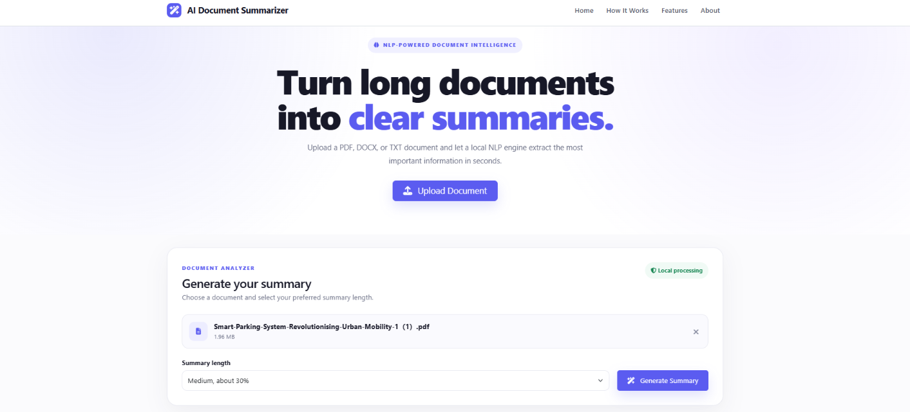

# AI Document Summarizer

A professional Flask web application that uses classical Natural Language Processing to create extractive summaries from PDF, DOCX, and TXT documents.

## Features

- PDF, DOCX and TXT support
- Drag and drop upload
- 10 MB upload limit
- Local NLP processing
- Extractive sentence ranking
- Short, medium and long summaries
- Document statistics
- Compression percentage
- Estimated reading time
- Processing time
- Copy summary
- Download summary as TXT
- Responsive UI
- Secure temporary file handling
- Automated tests
- No paid AI API required

## Technology Stack

- Python
- Flask
- NLTK
- pypdf
- python-docx
- scikit-learn
- NumPy
- Bootstrap 5
- JavaScript
- HTML5
- CSS3

## Architecture

```text
Browser
   |
   v
Flask Application
   |
   +--> Document Extraction
   |      +--> PDF
   |      +--> DOCX
   |      +--> TXT
   |
   +--> NLP Processing
   |      +--> Tokenization
   |      +--> Stopword removal
   |      +--> Word frequency
   |      +--> Sentence scoring
   |      +--> Sentence selection
   |
   +--> Statistics
   |
   v
JSON Response
   |
   v
Browser Results Dashboard
```

## Project Structure

```text
AI-Document-Summarizer/
│
├── app.py
├── config.py
├── requirements.txt
├── README.md
├── .gitignore
│
├── summarizer/
│   ├── __init__.py
│   ├── text_extractor.py
│   ├── nlp_processor.py
│   ├── summarizer.py
│   └── statistics.py
│
├── templates/
│   └── index.html
│
├── static/
│   ├── css/
│   │   └── style.css
│   └── js/
│       └── script.js
│
├── sample_documents/
│   └── sample_ai_article.txt
│
├── tests/
│   ├── test_app.py
│   ├── test_extractor.py
│   └── test_summarizer.py
│
├── uploads/
└── outputs/
```

## Installation on Windows

Open PowerShell in the project directory.

```powershell
python -m venv venv
venv\Scripts\activate
python -m pip install --upgrade pip
pip install -r requirements.txt
```

## Run

```powershell
python app.py
```

Open:

```text
http://127.0.0.1:5000
```

## Linux/macOS

```bash
python3 -m venv venv
source venv/bin/activate
python -m pip install --upgrade pip
pip install -r requirements.txt
python app.py
```

## How to Use

1. Open the web application.
2. Upload a PDF, DOCX or TXT file.
3. Select Short, Medium or Long.
4. Click Generate Summary.
5. Review the statistics.
6. Read or copy the summary.
7. Download the summary as a TXT file if required.

## NLP Approach

This project uses extractive summarization.

The algorithm:

1. Extracts text from the uploaded document.
2. Splits the text into sentences.
3. Tokenizes meaningful words.
4. Removes common stopwords.
5. Calculates word frequencies.
6. Normalizes word importance.
7. Scores sentences according to important words.
8. Adds small contextual bonuses for sentence position and useful numeric information.
9. Avoids highly similar selected sentences.
10. Returns the highest scoring sentences in their original order.

This approach is intentionally lightweight and can run without a GPU or external AI API.

## API

### POST `/summarize`

Multipart form fields:

- `file`
- `length`, one of `short`, `medium`, or `long`

Successful response:

```json
{
  "success": true,
  "filename": "example.pdf",
  "summary": "Generated summary...",
  "original_text": "Extracted text...",
  "statistics": {
    "original_words": 1000,
    "summary_words": 280,
    "original_characters": 6500,
    "summary_characters": 1900,
    "original_sentences": 50,
    "summary_sentences": 14,
    "compression_percentage": 72.0,
    "reading_time": 2
  },
  "processing_time": 0.85
}
```

### POST `/download`

JSON body:

```json
{
  "summary": "Generated summary...",
  "filename": "example.pdf"
}
```

Returns a TXT file.

### GET `/health`

Returns a simple application health response.

## Testing

Install dependencies, activate the virtual environment, then run:

```powershell
pytest -q
```

## Security

The application:

- Uses `secure_filename`
- Restricts file extensions
- Limits upload size to 10 MB
- Never executes uploaded documents
- Removes temporary uploaded files after processing
- Does not send document content to an external AI API

## Limitations

This is an extractive summarizer. It selects sentences from the source document instead of generating completely new sentences.

Scanned PDFs that contain only images may not produce useful text because OCR is not included in the base project.

Very technical or highly structured documents may require more advanced semantic models for higher-quality summaries.

## Future Improvements

Possible upgrades include:

- OCR for scanned PDFs
- Transformer-based summarization
- Multilingual summarization
- User accounts
- Summary history
- Database storage
- Keyword extraction
- Named entity recognition
- Document comparison
- Semantic search
- Cloud deployment
- Docker support

## 📸 Screenshots

### 🏠 Home Page



## License

This project is suitable for academic learning, portfolio demonstrations, and further development.

## Author

Developed as an NLP and Flask project demonstrating document processing, web development, and extractive text summarization.
